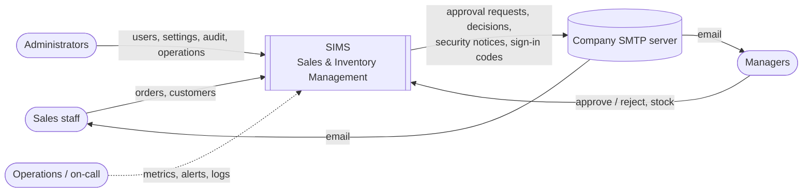
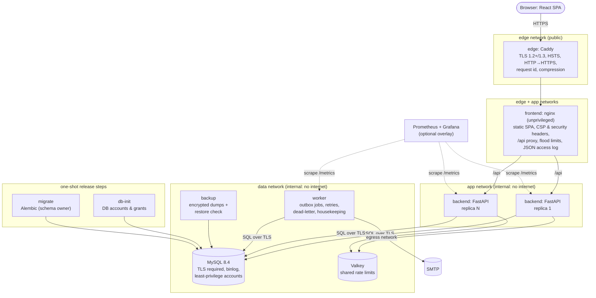
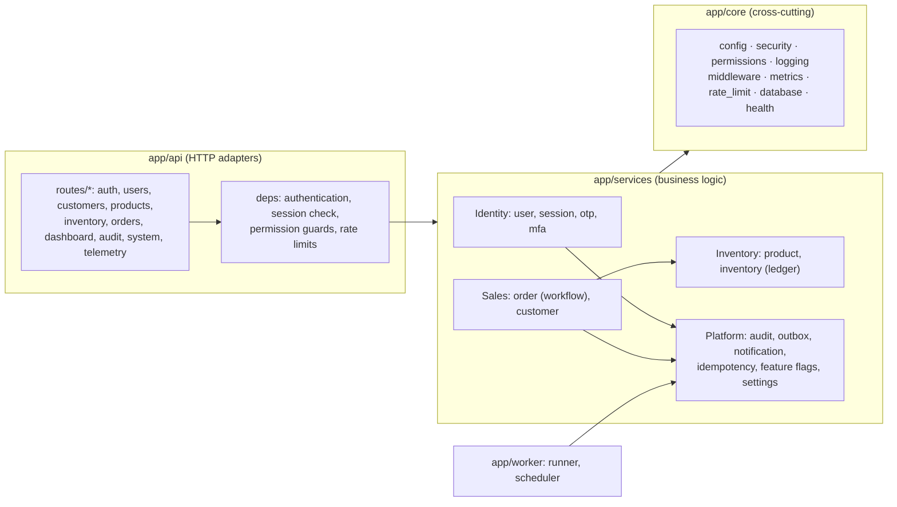
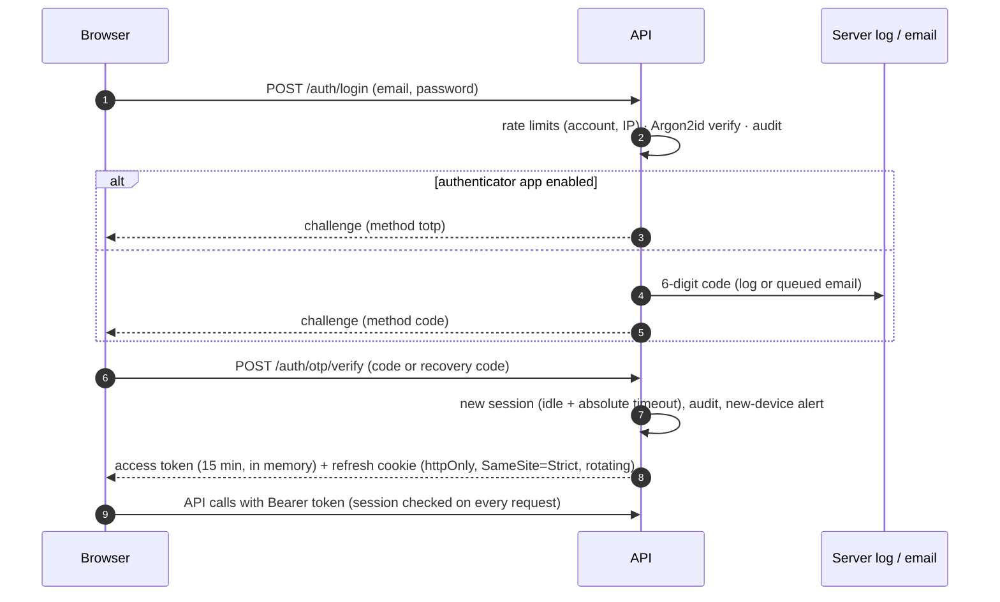
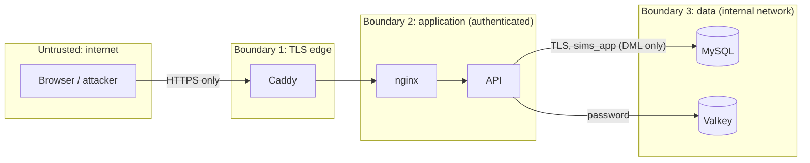

# Architecture

SIMS is a **modular monolith**: one API codebase with clear internal domains, deployed as stateless
containers that scale horizontally, plus a background worker. MySQL is the system of record (as the
brief requires); Valkey (the open-source Redis fork) holds short-lived shared state.

Diagrams are [Mermaid](https://mermaid.js.org) and render on GitHub. Decisions behind them are in
[../adr](../adr).

## 1. System context



## 2. Containers (one deployment)



| Container | Image | Runs as | Notes |
|---|---|---|---|
| edge | caddy:2.11.7-alpine | root without capabilities except NET_BIND_SERVICE | automatic certificates (ACME) |
| frontend | nginx-unprivileged 1.30.5 | uid 101 | read-only FS, renders its config at start |
| backend ×N | python:3.11.17-slim (multi-stage) | uid 10001 | read-only FS, hash-locked dependencies |
| worker | same image, `worker` role | uid 10001 | metrics on :9101, heartbeat file |
| migrate | same image, `migrate` role | uid 10001 | runs once per release, as the schema owner |
| mysql | mysql:8.4.11 | mysql | `require_secure_transport`, slow-query log, binlogs 7 days |
| redis | valkey:9.1.2-alpine | 999 | password, no persistence, 64 MB LRU |
| backup | mysql:8.4.11 | root without capabilities | AES-256 + HMAC, restore check every run |

## 3. Components inside the API (modular monolith)

Business workflows live in service functions. HTTP routers validate requests, enforce permissions
and serialize responses; platform routers also perform read-only status queries and wrap audited
administrative changes in transactions.



## 4. Key flows

### Order above the threshold (the brief's approval workflow)

```mermaid
sequenceDiagram
    autonumber
    participant S as Sales (browser)
    participant API as API
    participant DB as MySQL
    participant W as Worker
    participant M as Manager (email)
    S->>API: POST /orders (Idempotency-Key)
    API->>DB: BEGIN; lock products (FOR UPDATE, id order); validate stock
    API->>DB: order PENDING_APPROVAL, approval row, status history,<br/>audit entry, outbox job per approver, idempotency key
    API->>DB: COMMIT (all or nothing)
    API-->>S: 201 order (emails "Queued")
    W->>DB: claim due jobs (FOR UPDATE SKIP LOCKED)
    W->>M: approval request email (retry with backoff, dead-letter after 6 tries)
    M->>API: POST /orders/{id}/approve
    API->>DB: BEGIN; lock order; lock products; re-check stock;<br/>deduct + ledger; COMPLETED; audit; outbox decision job; COMMIT
    W->>S: decision email to the creator
```

### Sign-in



## 5. Deployment and scaling

- **Stateless API**: no local state; rate-limit counters live in Valkey, sessions in MySQL. Scale with
  `docker compose ... up -d --scale backend=N`; nginx re-resolves the service name every 10 s.
  Measured: one replica (1 CPU) ≈ 38 req/s at saturation; two replicas meet the latency SLO at
  55 req/s with headroom ([performance](../operations/performance.md)).
- **Background work** is separate from request handling: the API only writes outbox rows. Any
  number of workers can run (SKIP LOCKED); scheduled housekeeping uses MySQL named locks so each
  task runs once.
- **Release**: `db-init` (accounts) → `migrate` (schema, expand-only) → health-gated restart of API,
  worker and web. Image rollback does not downgrade the database. A migration-changing release
  needs a tested previous image compatible with the new schema or a forward fix: readiness checks
  reject a schema revision unknown to the image. One-host Compose can briefly interrupt requests;
  multi-host rolling or blue/green deployment needs platform support.
- **Graceful shutdown**: uvicorn drains in-flight requests (20 s) on SIGTERM; the worker finishes
  its current job; containers have a 30 s stop grace period.
- **Graceful degradation**: Valkey down → limits fall back to per-instance memory (alert fires);
  SMTP down → emails wait and retry, orders are unaffected; database down → 503 with Retry-After
  and readiness fails so load balancers stop sending traffic.

### Beyond one host

The containers map one-to-one to a Kubernetes deployment (API Deployment + HPA on CPU, worker
Deployment, migration Job as a pre-upgrade hook, CronJob for backups) or to ECS. MySQL becomes a
managed service (RDS / Cloud SQL with HA standby, read replica for reporting, PITR), Valkey becomes
ElastiCache/Memorystore, Caddy is replaced by the cloud load balancer + WAF. None of these need
code changes: every dependency is configured through environment variables or secret files.

## 6. Trust boundaries



| Boundary | What crosses it | Controls |
|---|---|---|
| Internet → edge | HTTPS requests | TLS 1.2+, HSTS, request id, edge flood limits, body size limit |
| Edge → web/API | proxied requests | trusted-proxy IP only for X-Forwarded-For, CSP, security headers, JSON-only bodies |
| Anonymous → authenticated | credentials, codes | Argon2id, 2nd factor, rate limits per account/IP, lockout, audit |
| Role → role | API calls | permission per endpoint (deny by default), object-level checks (404 for others' orders) |
| API → data | SQL | least-privilege account, TLS, parameterised queries, timeouts |
| Worker → SMTP | emails | only the worker has egress; content autoescaped; codes encrypted while queued |
