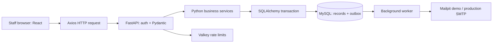

# Project walkthrough: roles, customers, sales and technology

SIMS is a staff-facing application for one company's sales and inventory operations.
Staff maintain customers and products, create sales orders, approve high-value orders,
and inspect inventory movements and sales summaries. Customers are business records;
the sign-in accounts belong to staff.

The complete [technology table](../README.md#technology-stack),
[architecture diagrams](architecture/README.md) and [Windows run commands](../RUN_COMMANDS.md)
support this walkthrough.

## Staff roles

The backend's [permission map](../backend/app/core/permissions.py) defines the permissions.
The browser uses the signed-in user's permissions to show available actions; API dependencies
enforce them independently. Order services also enforce ownership and self-approval rules.

| Capability | Sales | Manager | Admin |
|---|---|---|---|
| View dashboard, products and stock ledger | Yes | Yes | Yes |
| View/create/edit customer contact records | Yes | Yes | Yes |
| Deactivate/reactivate customers | No | Yes | Yes |
| Create sales orders | Yes | Yes | Yes |
| View individual orders | Own orders | All orders | All orders |
| Cancel an order awaiting approval | Own orders | Any pending order | Any pending order |
| Approve/reject an order awaiting approval | No | Another user's order | Another user's order |
| Create/edit/deactivate products; restock/adjust inventory | No | Yes | Yes |
| Change approval threshold/tax; administer users and roles | No | No | Yes |
| Inspect audit records, system status and background jobs | No | No | Yes |

Neither Managers nor Admins can approve or reject their own orders. Cancellation applies to
pending orders; completed sales do not have a cancellation/refund workflow in this version.
Customer records are shared among staff. The dashboard exposes company aggregates to all three
roles, even though Sales staff cannot open another employee's individual order.

## Customer tracking

Each [customer record](../backend/app/models/customer.py) has an ID, name, unique email,
optional phone/address, active flag and created/updated timestamps. Email is normalized to
lowercase and duplicates are refused. Staff can search by name, email or phone and filter
active/inactive customers with pagination.

An order stores `customer_id`, linking its history to the customer rather than duplicating
the entire contact record. The Orders page can search by customer name; role ownership rules
still apply. A Sales user can also add a customer from the New Order form.

Deactivation retains the customer and previous orders but blocks new orders for that customer.
Creation, edits and deactivation generate audit records identifying the staff actor and change.
Contact edits affect the shared customer record; unit prices and financial totals are stored
on each order separately. The application does not expose a customer sign-in portal or a
dedicated customer lifetime-value screen.

Approval emails go to active, verified Managers, falling back to Admins when no eligible Manager
exists. Decision emails go to the staff member who created the order. The customer's contact
email is stored as business information; these workflow messages are staff notifications.

## Sales orders and approval

1. A staff member selects an active customer, active products and quantities.
2. React Hook Form manages the inputs; Zod checks required selections and valid quantities.
   The browser previews subtotal, tax, total and whether approval is required.
3. Axios submits customer ID, product IDs, quantities and notes with an idempotency key.
4. FastAPI checks authentication/permissions; Pydantic validates the request shape.
5. The [order service](../backend/app/services/order_service.py) loads current database prices,
   checks active records and stock, and calculates amounts with Python `Decimal` rounded to cents.
   Browser totals are a preview; the server determines the stored amounts.
6. The tax-inclusive total is compared with the configured approval threshold. The default is
   50,000 with 18% tax, and Admins can change both settings for new orders.

| Condition or action | Result | Stock |
|---|---|---|
| Total is at or below the threshold | Auto-approved, then `COMPLETED` in the same transaction | Deducted immediately |
| Total exceeds the threshold | `PENDING_APPROVAL`; approval request is queued | Unchanged; no reservation |
| Another Manager/Admin approves | Approval, stock movement and `COMPLETED` commit together | Rechecked and deducted |
| Another Manager/Admin rejects with a reason | `REJECTED`; decision email is queued | Unchanged |
| Creator or Manager/Admin cancels while pending | `CANCELLED` | Unchanged |

The approval record retains its original threshold, decision maker, timestamp and comment.
The status timeline records transitions and who performed them. An order line stores its
unit-price snapshot, so later product price changes do not rewrite old sales.

Pending orders do not reserve stock. If other sales consume stock before approval, approval
fails and rolls back, leaving the order pending until stock is available or it is rejected/cancelled.
Product rows are locked in a consistent order to coordinate concurrent deductions.
Order, stock ledger, audit/history and email-outbox changes commit together or roll back together.
Reusing an idempotency key for the same submission returns the original order; a distinct
operation uses a new key.

## Inventory and sales summaries

Products store their current stock quantity and reorder level. The stock ledger explains each
opening balance, sale, restock or adjustment, with the signed quantity change, resulting balance,
actor, timestamp and order reference where applicable. Managers/Admins record stock changes
through these operations, with a note; negative resulting stock is refused.

The dashboard queries MySQL for completed-order revenue, order/status counts, pending-approval
value, revenue trends, top products and low/out-of-stock products. Pending, rejected and cancelled
orders are excluded from completed revenue. "Completed" is the internal order/inventory state;
the project has no integrated payment processor or shipment tracking.

## How the technology works together

- **React 18** renders pages such as Customers, New Order, Approvals and Dashboard from state and
  API results. **TypeScript** checks the contracts between forms, components and API helpers
  during development/builds. Runtime API validation is handled separately by Pydantic.
- **Vite** supplies the development server and builds static production files. Production
  Compose serves those files through nginx, which proxies `/api` requests to FastAPI.
- **Material UI** supplies inputs, dialogs, tables, navigation and responsive styling.
  **React Hook Form** manages values/errors and dynamic order lines; **Zod** describes browser
  validation rules and connects them through the form resolver.
- **TanStack Query** loads and caches server data. Successful order mutations invalidate order,
  product, dashboard, approval and inventory queries so they reload. The order detail page polls
  briefly while emails are queued; queries also refresh on window focus when stale.
- **Axios** sends requests with timeouts and a Bearer access token held in memory. It coordinates
  refresh requests using the rotating HttpOnly refresh cookie and exposes structured API errors
  to forms and notifications.
- **FastAPI/Python** route requests into permission dependencies and business services.
  **Pydantic** validates input types/constraints and defines response models.
- **SQLAlchemy** maps models to tables, executes queries and supports explicit transactions
  and `FOR UPDATE` locks. **MySQL** is the durable source for customers, products, orders,
  approvals, stock movements, sessions, audit records and outbox jobs.
- **Alembic** applies versioned schema changes. Production uses a migration step before starting
  the new application version rather than allowing every API replica to change the schema.
- The **background worker** claims committed email jobs from MySQL, sends through SMTP, retries
  transient failures and retains exhausted jobs for inspection/retry. This keeps SMTP out of
  the order request and preserves committed notifications across restarts. SMTP delivery is
  at least once; it does not provide an exactly-once guarantee.
- **Valkey** holds shared rate-limit counters. The Compose service is named `redis` because its
  protocol/client is Redis-compatible. Without it, a single native API can use in-memory limits.
  **Mailpit** supplies a demo SMTP inbox; production needs a real SMTP service.
- **Docker Compose** starts the web/API, MySQL, Valkey, worker, Mailpit and database setup steps.
  The native route runs frontend, API and worker directly and still requires MySQL.

## Suggested recording example

Use a fresh demo product so its starting balance is clear. Explain that the numbers below are
an illustrative setup, not the seeded company's current dashboard totals:

- As Admin, set threshold **3,000** and tax **18%** for new orders.
- As Manager, create a product priced at **1,000**, with **20** units and an unused SKU.
- As Sales, add/select a customer and buy **2** units: subtotal **2,000**, tax **360**, total
  **2,360**. It completes immediately; stock becomes **18**.
- Create a **5**-unit order: subtotal **5,000**, tax **900**, total **5,900**. It waits for
  approval and stock stays **18**. Show the manager's request email in Mailpit.
- As Manager, approve that Sales order. Stock becomes **13**; show the status timeline, sale
  ledger movement and decision email to the Sales employee.
- Create another high-value order and reject it with a reason. Stock stays unchanged.
- Restock **5** twice as two separate deliveries: **13 → 18 → 23**. Each delivery has its own
  ledger entry. Show the dashboard and a phone-width layout, then the relevant code and tests.

Start with purpose and roles, demonstrate customer/order/approval/email/stock, then explain
the request path, transaction/outbox design and test evidence. Demo sign-in uses a second factor;
the default demo writes codes to backend logs, while production should use email or TOTP.

## Verification and recruiter ZIP

The preceding merged build passed 258 backend tests (95% coverage), 50 frontend tests, eight
DAST gate tests, 24 Chromium tests and 14 acceptance tests in each of Firefox and WebKit.
Those results belong to that tested application revision. For this documentation update,
check the latest [CI](https://github.com/Cherie05/SIMS-Demo/actions/workflows/ci.yml) and
[CodeQL](https://github.com/Cherie05/SIMS-Demo/actions/workflows/codeql.yml) results on `main`.
The scan retains the documented MUI style CSP warning; other unaccepted findings fail.

From the public repository, select branch **main**, then **Code → Download ZIP**.
GitHub's archive contains tracked source, including `.github`, migrations, lockfiles, README,
docs and run commands. Extract it before running the application. Dependency folders and real
environment files are installed/created by the reviewer using the documented setup.
The ignored `LOOM_VIDEO_SCRIPT.md`, local `.env` files, caches and private notes are excluded.

Send the repository link, final source ZIP and an accessible Loom link to the recruiter.
See [repository setup](github-repository-setup.md) for permissions and the complete handoff.
